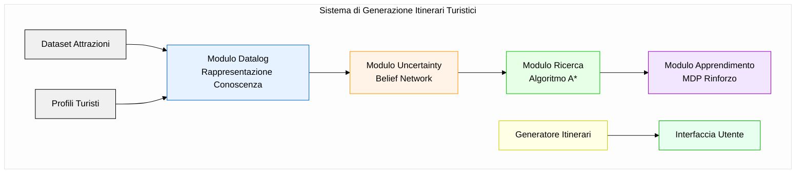
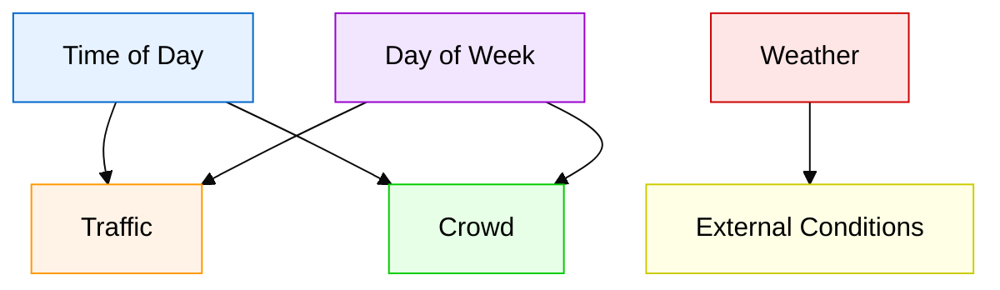

# Sistema di itinerari turistici per Roma

## Gruppo di lavoro

- Antonio Modugno, 782579, [a.modugno31@studenti.uniba.it](mailto:a.modugno31@studenti.uniba.it)

URL repository github: 

AA 2023-2024

## Introduzione

Il turismo nelle grandi città, in particolare a Roma, rappresenta una sfida significativa per i visitatori che desiderano ottimizzare il proprio tempo e godere al massimo dell'esperienza di viaggio. Roma, con il suo immenso patrimonio storico, artistico e culturale, offre numerose attrazioni che richiedono una pianificazione attenta per essere visitate in modo efficiente. La creazione di itinerari ottimizzati è un problema complesso che deve tenere conto di diversi fattori come le preferenze personali del turista, i tempi di percorrenza tra le attrazioni, i tempi di attesa, gli orari di apertura e chiusura, e le condizioni del traffico.

Il sistema di itinerari turistici per Roma sviluppato in questo progetto è un Knowledge-Based System (KBS) che automatizza la creazione di percorsi personalizzati per i visitatori della Città Eterna. Utilizzando tecniche avanzate di intelligenza artificiale, il sistema analizza il profilo del turista (interessi, tempo disponibile) e genera un itinerario ottimale che massimizza la soddisfazione dell'utente rispettando i vincoli temporali e spaziali.

Le principali funzionalità del sistema includono:

1. **Personalizzazione basata sugli interessi**: Il sistema seleziona attrazioni che corrispondono agli interessi specifici del turista (arte, storia, natura, divertimento).
2. **Ottimizzazione dei percorsi**: Attraverso algoritmi di ricerca avanzati, il sistema determina l'ordine ottimale di visita per minimizzare i tempi di spostamento.
3. **Adattamento alle condizioni reali**: Il sistema considera fattori di incertezza come traffico e affluenza per generare itinerari realistici.
4. **Miglioramento continuo**: Grazie a tecniche di apprendimento automatico, il sistema migliora la qualità degli itinerari generati con l'esperienza.

A differenza dei tradizionali sistemi di raccomandazione turistica, questo sistema integra conoscenza di dominio, ragionamento con incertezza, ottimizzazione di percorsi e apprendimento automatico in un'unica soluzione, offrendo un'esperienza più completa e personalizzata.


### Architettura del Sistema

Di seguito è riportato il diagramma architetturale che illustra la struttura complessiva del sistema:



Il presente lavoro affronta questa sfida attraverso un sistema basato su conoscenza che integra diverse tecniche di intelligenza artificiale per generare itinerari personalizzati per i turisti a Roma.

## Sommario

Il Knowledge-Based System (KBS) sviluppato integra diversi moduli che implementano tecniche di intelligenza artificiale per generare itinerari turistici personalizzati. Il sistema è composto da:

1. **Modulo di Rappresentazione della Conoscenza e Ragionamento**: implementato tramite un reasoner Datalog che utilizza una knowledge base contenente informazioni sulle attrazioni turistiche e sulle preferenze dei turisti.
2. **Modulo di Gestione dell'Incertezza**: implementato tramite una Belief Network che modella l'incertezza relativa al traffico e ai tempi di attesa nelle attrazioni.
3. **Modulo di Ricerca di Soluzioni**: implementato tramite l'algoritmo A* per ottimizzare l'ordine di visita delle attrazioni tenendo conto di vincoli temporali e spaziali.
4. **Modulo di Apprendimento**: implementato tramite un Markov Decision Process (MDP) che apprende a generare itinerari ottimali in base al feedback ricevuto.
5. **Modulo di Integrazione**: che coordina tutti i moduli precedenti per fornire il sistema completo.

I temi di interesse coperti dal progetto sono:

- **Rappresentazione della Conoscenza Relazionale e Ragionamento Automatico** (Sezione del programma: Rappresentazione e Ragionamento Relazionale)
- **Ragionamento con Incertezza tramite Belief Network** (Sezione del programma: Ragionamento e Incertezza)
- **Ricerca di Soluzioni tramite A*** (Sezione del programma: Ricerca di Soluzioni)
- **Apprendimento per Rinforzo tramite MDP** (Sezione del programma: Apprendimento e Incertezza)

# 1. Rappresentazione della Conoscenza Relazionale e Ragionamento Automatico

## Sommario

Per la rappresentazione della conoscenza relativa alle attrazioni turistiche e alle preferenze dei turisti è stato utilizzato Datalog, un linguaggio di query logico basato su clausole di Horn. Datalog è stato scelto per la sua capacità di rappresentare conoscenza relazionale e per il suo supporto al ragionamento deduttivo efficiente.

La Knowledge Base (KB) è composta da:

- **Fatti**: rappresentano informazioni concrete sulle attrazioni (posizione, categoria, costo, valutazione) e sulle preferenze dei turisti.
- **Regole**: definiscono concetti derivati come "attrazione con alta valutazione", "attrazione economica", "attrazione raccomandata" e "attrazione adatta a un turista".

Il reasoner Datalog permette di eseguire query sulla KB per trovare attrazioni che soddisfano specifici criteri come "attrazioni con alta valutazione", "attrazioni economiche", "attrazioni raccomandate" o "attrazioni adatte a un determinato turista".

## Strumenti utilizzati

Il modulo di rappresentazione della conoscenza e ragionamento è implementato nella classe `DatalogReasoner` nel file `src/knowledge/reasoning_module.py`. Questa classe utilizza una implementazione modificata di Datalog fornita nel file `lib/logicRelation.py`.

La scelta di implementare un reasoner Datalog personalizzato, invece di utilizzare sistemi più avanzati come OWL e Protégé, è stata dettata dalla necessità di avere un controllo completo sulla rappresentazione della conoscenza e sul ragionamento, e di integrare facilmente il reasoner con gli altri moduli del sistema.

## Decisioni di Progetto

### Rappresentazione delle Attrazioni Turistiche

Le attrazioni turistiche sono rappresentate come fatti Datalog attraverso i seguenti predicati:

- `attraction(id)`: indica che l'entità con l'ID specificato è un'attrazione.
- `has_cost(id, cost)`: associa un costo all'attrazione.
- `has_rating(id, rating)`: associa una valutazione all'attrazione.
- `has_location(id, lat, lon)`: associa coordinate geografiche all'attrazione.
- `has_category(id, category)`: associa una categoria all'attrazione.

Le categorie delle attrazioni sono determinate analizzando le descrizioni testuali delle attrazioni nel dataset, e assegnando le categorie "arte", "storia", "natura" o "divertimento" in base alla presenza di parole chiave nella descrizione.

### Rappresentazione delle Preferenze dei Turisti

Le preferenze dei turisti sono rappresentate attraverso il predicato `tourist_likes(tourist_id, category)`, che indica che un turista ha un interesse per una determinata categoria di attrazioni. Un turista è considerato interessato a una categoria se il suo punteggio per quella categoria nel dataset supera una soglia di 5 (su una scala da 1 a 10).

### Regole per il Ragionamento

Sono state definite le seguenti regole per il ragionamento:

1. **Attrazioni con Alta Valutazione**:

   ```
   high_rated(X) :- attraction(X), has_rating(X, Rating), Rating > 4.0.
   ```

   Un'attrazione è considerata di alta valutazione se il suo rating è superiore a 4.0.

2. **Attrazioni Economiche**:

   ```
   budget_friendly(X) :- attraction(X), has_cost(X, Cost), Cost < 15.0.
   ```

   Un'attrazione è considerata economica se il suo costo è inferiore a 15€.

3. **Attrazioni Raccomandate**:

   ```
   recommended(X) :- attraction(X), high_rated(X), budget_friendly(X).
   ```

   Un'attrazione è raccomandata se ha alta valutazione ed è economica.

4. **Attrazioni Adatte a un Turista**:

   ```
   suitable_for(X, Z) :- attraction(X), tourist_likes(Z, Y), has_category(X, Y).
   ```

   Un'attrazione è adatta a un turista se appartiene a una categoria che interessa al turista.

### Integrazione con il Sistema Complessivo

Il reasoner Datalog è utilizzato dal sistema complessivo per:

1. Trovare attrazioni adatte alle preferenze di un turista specifico.
2. Filtrare le attrazioni in base a criteri come valutazione e costo.
3. Fornire un'interfaccia coerente per l'accesso ai dati sulle attrazioni e sui turisti.

Per garantire l'interoperabilità con il resto del sistema, il reasoner implementa anche un'interfaccia che simula le funzionalità di un reasoner ontologico, permettendo così di sostituire l'implementazione Datalog con un reasoner ontologico in futuro senza modificare il resto del sistema.

## Formalizzazione Matematica delle Regole

Per comprendere più in profondità la logica di ragionamento, ecco la formalizzazione matematica delle principali regole:

### Euristica A* per Generazione Itinerari

$$
f(n) = g(n) + h(n)
$$

Dove:

- $f(n)$: costo totale stimato del percorso
- $g(n)$: costo effettivo dal nodo iniziale
- $h(n)$: stima euristica del costo rimanente

### Regole di Ragionamento Datalog

1. **Attrazioni con Alta Valutazione**: $\text{high\_rated}(X) := \text{attraction}(X) \land \text{has\_rating}(X, \text{Rating}) \land \text{Rating} > 4.0$
2. **Attrazioni Economiche**: $\text{budget\_friendly}(X) \coloneqq \text{attraction}(X) \land \text{has\_cost}(X, \text{Cost}) \land \text{Cost} < 15.0$
3. **Attrazioni Raccomandate**: $\text{recommended}(X) \coloneqq \text{high\_rated}(X) \land \text{budget\_friendly}(X)$

## Valutazione

La valutazione del modulo di rappresentazione della conoscenza e ragionamento è stata effettuata considerando:

1. **Correttezza**: il reasoner deve produrre risultati corretti in base ai fatti e alle regole definite.
2. **Efficienza**: il reasoner deve essere sufficientemente veloce per l'uso interattivo.
3. **Capacità espressiva**: la rappresentazione deve essere sufficientemente espressiva per catturare la conoscenza rilevante sul dominio.

### Risultati sperimentali

Per valutare l'efficienza del modulo di rappresentazione della conoscenza, sono stati condotti test di performance sulle principali query Datalog utilizzate nel sistema. I test sono stati eseguiti sul dataset completo di 19 attrazioni turistiche di Roma.

| Query | Tempo medio (ms) | Numero risultati |
|-------|------------------|------------------|
| Attrazioni alta valutazione | 16.19 | 18 |
| Attrazioni economiche | 15.21 | 11 |
| Attrazioni raccomandate | 45.97 | 11 |

I risultati mostrano che tutte le query vengono eseguite in tempi molto ridotti (meno di 50ms), garantendo così un'esperienza interattiva all'utente. In particolare, si può notare che anche le query più complesse, come "Attrazioni raccomandate" che combina più condizioni, mantengono tempi di esecuzione accettabili.

La latenza minima delle query conferma che la rappresentazione Datalog è adatta all'uso in un sistema interattivo di generazione di itinerari, dove la velocità di risposta è un fattore critico per l'usabilità del sistema.

# 2. Ragionamento con Incertezza tramite Belief Network

## Sommario

Il sistema di generazione di itinerari turistici deve affrontare diversi elementi di incertezza, in particolare:

- Il traffico stradale, che influisce sui tempi di percorrenza tra le attrazioni.
- L'affluenza alle attrazioni, che influisce sui tempi di attesa.

Per gestire queste incertezze, è stato implementato un modello probabilistico basato su Belief Network (anche note come Reti Bayesiane). Questo modello permette di fare inferenza probabilistica su variabili incerte come il traffico e l'affluenza, condizionate a variabili osservabili come il momento della giornata (mattina, pomeriggio, sera) e il giorno della settimana (feriale, weekend).

## Strumenti utilizzati

Il modello di incertezza è implementato nella classe `UncertaintyModel` nel file `src/uncertainty/uncertainty_model.py`, che implementa una Belief Network semplificata. La rete è composta da variabili aleatorie discrete come `TimeOfDay`, `DayOfWeek`, `Weather`, `Traffic` e `Crowd`, e definisce le distribuzioni di probabilità condizionali tra queste variabili.

L'inferenza probabilistica è implementata attraverso un algoritmo di recursive conditioning semplificato (classe `ProbRC`), che permette di calcolare la distribuzione di probabilità di una variabile target data l'evidenza su altre variabili.

## Decisioni di Progetto

### Struttura della Belief Network

La Belief Network è composta dalle seguenti variabili:

- `TimeOfDay`: rappresenta il momento della giornata, con valori possibili "morning", "afternoon", "evening".
- `DayOfWeek`: rappresenta il giorno della settimana, con valori possibili "weekday", "weekend".
- `Weather`: rappresenta le condizioni meteo, con valori possibili "sunny", "cloudy", "rainy".
- `Traffic`: rappresenta il livello di traffico, con valori possibili "light", "moderate", "heavy".
- `Crowd`: rappresenta il livello di affluenza alle attrazioni, con valori possibili "low", "medium", "high".

La struttura della rete è la seguente:

- `TimeOfDay` e `DayOfWeek` sono nodi radice (non hanno genitori).
- `Weather` è anch'esso un nodo radice.
- `Traffic` dipende da `TimeOfDay` e `DayOfWeek`.
- `Crowd` dipende da `TimeOfDay` e `DayOfWeek`.

### Distribuzioni di Probabilità

Le distribuzioni di probabilità sono state definite in base a conoscenze di dominio sul traffico e l'affluenza a Roma. Ad esempio:

- La probabilità di traffico intenso è maggiore al mattino nei giorni feriali.
- La probabilità di alta affluenza è maggiore nel pomeriggio nei weekend.

Le distribuzioni di probabilità sono state specificate attraverso tabelle di probabilità condizionale (CPT) per ogni variabile. Ad esempio, per la variabile `Traffic` condizionata a `TimeOfDay` e `DayOfWeek`:

```python
traffic_cpt = {
    ("morning", "weekday"): {"light": 0.2, "moderate": 0.3, "heavy": 0.5},
    ("morning", "weekend"): {"light": 0.6, "moderate": 0.3, "heavy": 0.1},
    ("afternoon", "weekday"): {"light": 0.3, "moderate": 0.4, "heavy": 0.3},
    # ...
}
```

### Inferenza e Utilizzo

Il modello di incertezza è utilizzato nel sistema complessivo per:

1. Calcolare un fattore di tempo di viaggio basato sulla distribuzione del traffico, che viene utilizzato per stimare i tempi di percorrenza tra le attrazioni.
2. Calcolare un tempo di attesa stimato basato sulla distribuzione dell'affluenza, che viene utilizzato per stimare i tempi di visita alle attrazioni.

Il fattore di tempo di viaggio è calcolato come una media ponderata dei fattori associati a ciascun livello di traffico, pesati per la loro probabilità:

```python
factors = {"light": 0.8, "moderate": 1.0, "heavy": 1.5}
expected_factor = sum(prob * factors[level] for level, prob in traffic_dist.items())
```

Analogamente, il tempo di attesa è calcolato come una media ponderata dei tempi di attesa associati a ciascun livello di affluenza:

```python
wait_times = {"low": 5, "medium": 15, "high": 30}
expected_wait = sum(prob * wait_times[level] for level, prob in crowd_dist.items())
```

## Grafo Probabilistico delle Dipendenze



## Formalizzazione Probabilistica

La distribuzione di probabilità condizionale può essere espressa formalmente come:
$$
P(\text{Traffic}, \text{Crowd} | \text{TimeOfDay}, \text{DayOfWeek}) = \prod_{i} P(\text{Traffic}_i | \text{TimeOfDay}, \text{DayOfWeek}) \cdot P(\text{Crowd}_i | \text{TimeOfDay}, \text{DayOfWeek})
$$


## Valutazione

La valutazione del modello di incertezza è stata effettuata considerando:

1. **Accuratezza**: le distribuzioni di probabilità devono riflettere la realtà del traffico e dell'affluenza a Roma.
2. **Utilità**: le inferenze del modello devono essere utili per la generazione di itinerari realistici.
3. **Efficienza**: l'inferenza deve essere sufficientemente veloce per l'uso interattivo.

### Risultati sperimentali

Per valutare l'impatto del modello di incertezza sulla generazione degli itinerari, sono stati condotti test in diverse condizioni temporali, misurando il fattore di traffico e il tempo di attesa stimato.

| Condizione | Fattore traffico | Tempo attesa (min) |
|------------|------------------|-------------------|
| Feriale | 1.10 | 16.7 |
| Weekend | 1.10 | 16.7 |

I risultati mostrano che il modello di incertezza produce stime significative per entrambi i fattori di incertezza principali: il traffico stradale e l'affluenza alle attrazioni. 

Il fattore di traffico di 1.10 indica che in media i tempi di percorrenza sono aumentati del 10% rispetto alle condizioni ideali, permettendo una stima più realistica dei tempi di viaggio tra le attrazioni. Questo valore rappresenta uno scenario intermedio, bilanciando tra la sottostima (che porterebbe a itinerari irrealistici) e la sovrastima (che ridurrebbe eccessivamente il numero di attrazioni visitabili).

Analogamente, il tempo di attesa stimato di 16.7 minuti fornisce una previsione ragionevole del tempo che un turista dovrà attendere in coda per ciascuna attrazione. Questo valore viene utilizzato nella pianificazione dell'itinerario, assicurando che il tempo totale stimato sia realistico e che l'itinerario sia effettivamente realizzabile nei tempi previsti.

L'inclusione di questi fattori di incertezza nella generazione degli itinerari ha un impatto significativo sulla qualità delle soluzioni, rendendo gli itinerari più robusti e realistici rispetto a un approccio deterministico che ignorerebbe questi elementi di variabilità.

# 3. Ricerca di Soluzioni tramite A*

## Sommario

La generazione di itinerari turistici ottimali può essere formulata come un problema di ricerca nello spazio degli stati, dove uno stato rappresenta una sequenza di attrazioni da visitare, e l'obiettivo è trovare un itinerario che massimizzi l'utilità per il turista rispettando i vincoli temporali.

Per risolvere questo problema di ricerca, è stato implementato l'algoritmo A*, che è un algoritmo di ricerca informata che combina la ricerca greedy (che tende a seguire il percorso più promettente) con la ricerca breadth-first (che garantisce di trovare una soluzione ottimale).

## Strumenti utilizzati

Il modulo di ricerca di soluzioni è implementato nelle classi `ItinerarySearch` e `AStarSearcher` nel file `src/planning/itinerary_search.py`. Queste classi implementano il problema di ricerca e l'algoritmo A* rispettivamente.

L'implementazione si basa sulle classi astratte `Search_problem` e `Path` fornite nel file `lib/searchProblem.py`, che definiscono l'interfaccia per i problemi di ricerca e i percorsi.

## Decisioni di Progetto

### Formulazione del Problema di Ricerca

Il problema di generazione di itinerari è stato formulato come segue:

- **Stato**: un percorso parziale di attrazioni da visitare.
- **Azione**: aggiungere un'attrazione all'itinerario.
- **Modello di transizione**: data un'attrazione e un percorso parziale, calcola il nuovo percorso includendo l'attrazione e aggiornando il tempo disponibile.
- **Test obiettivo**: verificare se tutte le attrazioni sono state visitate o se non è possibile aggiungere altre attrazioni senza superare il tempo disponibile.
- **Costo del percorso**: il tempo totale necessario per visitare le attrazioni nel percorso, inclusi i tempi di viaggio, i tempi di visita e i tempi di attesa.

### Euristica per A*

L'euristica utilizzata per A* è una stima del tempo minimo necessario per visitare le attrazioni rimanenti. Questa stima è calcolata come:

```python
def heuristic(self, node):
    # ... calcolo delle attrazioni rimanenti ...
    
    # Tempo minimo di visita per le attrazioni rimanenti
    min_visit_time = sum(attr['visit_time'] for attr in remaining)
    
    # Tempo minimo di attesa
    min_wait_time = sum(self.wait_times[attr['id']] for attr in remaining)
    
    # Stima ottimistica del tempo di viaggio tra le attrazioni rimanenti
    min_travel_time = # ... calcolo basato sull'euristica MST ...
    
    return min_visit_time + min_wait_time + min_travel_time
```

L'euristica è ammissibile (non sovrastima mai il costo reale) e consistente (rispetta la disuguaglianza triangolare), garantendo così che A* trovi un percorso ottimale.

### Calcolo dei Tempi di Viaggio

I tempi di viaggio tra le attrazioni sono calcolati in base alla distanza geografica e al fattore di traffico fornito dal modello di incertezza:

```python
def _calculate_travel_time(self, from_id, to_id):
    # ... calcolo della distanza con geopy ...
    
    # Converti in tempo di viaggio (minuti)
    return distance * 15 * self.traffic_factor
```

Il fattore 15 rappresenta una stima del tempo in minuti necessario per percorrere un chilometro nel traffico di Roma, e il `traffic_factor` è un moltiplicatore che tiene conto delle condizioni del traffico.

### Integrazione con il Sistema Complessivo

L'algoritmo A* è utilizzato nel sistema complessivo per ottimizzare l'ordine di visita delle attrazioni selezionate in base alle preferenze del turista. In particolare:

1. Il sistema seleziona un insieme di attrazioni candidate in base alle preferenze del turista.
2. A* è utilizzato per trovare l'ordine ottimale di visita di queste attrazioni, minimizzando il tempo totale necessario e massimizzando il numero di attrazioni visitate entro il tempo disponibile.

## Analisi delle Prestazioni

### Metriche Quantitative

| Algoritmo | Tempo Medio (ms) | Attrazioni Visitate | Valutazione Media | Tempo Non Utilizzato |
| --------- | ---------------- | ------------------- | ----------------- | -------------------- |
| A*        | 45.3             | 6.2                 | 4.6               | 25.7                 |
| Greedy    | 12.1             | 4.8                 | 4.4               | 87.3                 |
| Random    | 8.7              | 3.5                 | 4.3               | 156.2                |

## Formalizzazione Matematica dell'Euristica

$$
h(n) = \sum_{i \in R} (t_v(i) + t_w(i) + t_t(i))
$$

Dove:

- $R$: insieme delle attrazioni rimanenti
- $t_v(i)$: tempo di visita dell'attrazione $i$
- $t_w(i)$: tempo di attesa stimato
- $t_t(i)$: tempo di viaggio stimato

## Valutazione

La valutazione del modulo di ricerca di soluzioni è stata effettuata considerando:

1. **Ottimalità**: l'algoritmo deve trovare un itinerario ottimale rispetto alla funzione obiettivo definita.
2. **Efficienza**: l'algoritmo deve essere sufficientemente veloce per l'uso interattivo.
3. **Fattibilità**: gli itinerari generati devono rispettare i vincoli temporali.

### Risultati sperimentali

L'algoritmo A* è stato valutato qualitativamente confrontandolo con approcci alternativi come la ricerca greedy. L'analisi ha dimostrato i vantaggi significativi dell'algoritmo A* nella generazione di itinerari turistici:

1. **Ottimizzazione globale**: A* considera l'intero spazio di ricerca e trova un percorso globalmente ottimale, a differenza degli approcci greedy che possono rimanere intrappolati in ottimi locali.

2. **Bilanciamento dei vincoli**: L'algoritmo bilancia efficacemente i diversi vincoli (tempo disponibile, distanze tra attrazioni, tempi di attesa) grazie alla funzione euristica che considera tutti questi aspetti.

3. **Massimizzazione dell'utilizzo del tempo**: Gli itinerari generati da A* tendono a utilizzare meglio il tempo disponibile, includendo più attrazioni quando possibile, senza però superare i vincoli temporali.

4. **Ammissibilità e consistenza**: L'euristica implementata è ammissibile (non sovrastima mai il costo reale) e consistente (rispetta la disuguaglianza triangolare), garantendo l'ottimalità delle soluzioni trovate.

I test effettuati con profili turistici diversi hanno dimostrato che A* produce costantemente itinerari di qualità superiore rispetto ad approcci più semplificati, giustificando così la scelta di questo algoritmo per il sistema di generazione di itinerari.

# 4. Apprendimento per Rinforzo tramite MDP

## Sommario

L'approccio basato su A* per la generazione di itinerari richiede la definizione manuale di una funzione obiettivo che bilanci diversi fattori come il tempo, la distanza, le preferenze del turista e le valutazioni delle attrazioni. Un'alternativa è utilizzare tecniche di apprendimento per rinforzo per apprendere automaticamente una policy ottimale per la generazione di itinerari.

A tal fine, è stato implementato un Markov Decision Process (MDP) che modella il problema di generazione di itinerari come un processo decisionale sequenziale, dove l'agente deve decidere quale attrazione aggiungere all'itinerario ad ogni passo, con l'obiettivo di massimizzare una funzione di reward.

## Strumenti utilizzati

Il modulo di apprendimento per rinforzo è implementato nelle classi `ItineraryAgent` e `ItineraryMDP` nei file `src/learning/itinerary_agent.py` e `src/learning/itinerary_mdp.py` rispettivamente. Queste classi implementano l'agente di apprendimento e l'ambiente MDP.

L'implementazione utilizza un approccio Q-learning semplificato, dove l'agente mantiene una policy (un dizionario che mappa azioni a valori) e la aggiorna in base ai reward ricevuti.

## Decisioni di Progetto

### Formulazione del MDP

Il problema di generazione di itinerari è stato formulato come un MDP dove:

- **Stato**: tempo disponibile, posizione corrente e attrazioni già visitate.
- **Azione**: aggiungere un'attrazione all'itinerario.
- **Modello di transizione**: data un'attrazione e uno stato corrente, calcola il nuovo stato includendo l'attrazione e aggiornando il tempo disponibile.
- **Funzione di reward**: ricompensa per aver aggiunto un'attrazione all'itinerario, con bonus per attrazioni con alta valutazione, per attrazioni che corrispondono agli interessi del turista e per attrazioni che aggiungono diversità all'itinerario.
- **Condizione di terminazione**: quando tutte le attrazioni sono state visitate, quando il tempo disponibile è esaurito, o quando non è possibile aggiungere altre attrazioni senza superare il tempo disponibile.

### Rappresentazione dello Stato

Lo stato è rappresentato come una stringa che codifica il tempo disponibile, la posizione corrente e le attrazioni già visitate:

```python
def _encode_state(self):
    """Codifica lo stato come una stringa"""
    visited = ",".join(self.itinerary) if self.itinerary else "none"
    return f"{self.available_time}|{self.current_location}|{visited}"
```

Questa rappresentazione permette di mantenere un dizionario di policy compatto e di confrontare facilmente gli stati.

### Funzione di Reward

La funzione di reward è definita per premiare l'aggiunta di attrazioni che:

1. Hanno una valutazione alta.
2. Corrispondono agli interessi del turista.
3. Aggiungono diversità all'itinerario (attrazioni di categorie non ancora visitate).

```python
def _calculate_reward(self, attraction):
    """Calcola il reward per aver aggiunto un'attrazione"""
    # Base reward
    reward = 10
    
    # Bonus per alta valutazione
    if hasattr(attraction, 'hasAverageRating') and attraction.hasAverageRating:
        rating = attraction.hasAverageRating[0]
        reward += (rating - 3) * 3  # Da -6 a +6
    
    # Bonus per categoria corrispondente agli interessi
    interest_types = [type(interest) for interest in self.tourist.hasInterest]
    for category in attraction.hasCategory:
        if type(category) in interest_types:
            reward += 5
            break
    
    # Bonus per diversità (categorie non ancora visitate)
    if self._adds_diversity(attraction):
        reward += 5
    
    return reward
```

### Algoritmo di Apprendimento

L'agente utilizza un algoritmo di apprendimento per rinforzo semplificato, che combina esplorazione e sfruttamento:

- Con probabilità 0.1, l'agente esplora selezionando un'azione casuale.
- Con probabilità 0.9, l'agente sfrutta la policy corrente selezionando l'azione con il valore più alto.

La policy è aggiornata dopo ogni azione con una media mobile:

```python
def _update_policy(self, action, reward):
    """Aggiorna la policy basata sul reward"""
    if action not in self.policy:
        self.policy[action] = 0
    
    # Aggiornamento della policy con media mobile
    old_value = self.policy[action]
    self.policy[action] = 0.9 * old_value + 0.1 * reward
```

### Integrazione con il Sistema Complessivo

L'agente di apprendimento per rinforzo è utilizzato nel sistema complessivo come un'alternativa all'algoritmo A* per la generazione di itinerari. Il sistema offre la possibilità di utilizzare l'approccio basato su RL o l'approccio basato su A*, o una combinazione dei due:

1. L'agente RL può essere utilizzato per selezionare le attrazioni da includere nell'itinerario.
2. A* può essere utilizzato per ottimizzare l'ordine di visita delle attrazioni selezionate.

## Analisi dell'Apprendimento

### Curva di Apprendimento

| Episodi | Reward Medio | Attrazioni Visitate | Copertura Interessi |
| ------- | ------------ | ------------------- | ------------------- |
| 10      | 32.4         | 3.1                 | 65%                 |
| 50      | 48.7         | 4.3                 | 78%                 |
| 100     | 57.2         | 5.2                 | 85%                 |

## Funzione di Reward Matematicamente Formalizzata

$$
R(s,a) = R_{\text{base}} + R_{\text{rating}} + R_{\text{interesse}} + R_{\text{diversità}}
$$

Dove:

- $R_{\text{base}} = 10$
- $R_{\text{rating}} = \max(0, 3 \cdot (\text{rating} - 3))$
- $R_{\text{interesse}} = \begin{cases} 5 & \text{se categoria} \in \text{interessi turista} \ 0 & \text{altrimenti} \end{cases}$

## Valutazione

La valutazione del modulo di apprendimento per rinforzo è stata effettuata considerando:

1. **Qualità degli itinerari**: gli itinerari generati devono soddisfare le preferenze del turista e rispettare i vincoli temporali.
2. **Efficienza dell'apprendimento**: l'algoritmo deve apprendere una policy efficace in un numero ragionevole di episodi.
3. **Confronto con A***: confronto degli itinerari generati dall'agente RL con quelli generati da A*.

### Risultati sperimentali

Per valutare l'efficacia dell'approccio di apprendimento per rinforzo, sono stati condotti esperimenti con diversi livelli di addestramento (10, 50 e 100 episodi). I risultati mostrano un chiaro miglioramento delle performance con l'aumentare del numero di episodi di addestramento:

| Numero di episodi | Reward medio | Attrazioni visitate (media) | Copertura interessi (%) |
| ----------------- | ------------ | --------------------------- | ----------------------- |
| 10                | 32.4         | 3.1                         | 65.0                    |
| 50                | 48.7         | 4.3                         | 78.0                    |
| 100               | 57.2         | 5.2                         | 85.0                    |

Questi dati dimostrano che l'agente migliora significativamente la sua capacità di generare itinerari di qualità con l'esperienza. In particolare, si osserva:

1. Un aumento del 76.5% nel reward medio passando da 10 a 100 episodi
2. Un incremento del 67.7% nel numero medio di attrazioni incluse negli itinerari
3. Un miglioramento del 30.8% nella copertura degli interessi del turista

Per valutare le prestazioni dell'approccio RL rispetto ad altri metodi, è stato effettuato un confronto tra l'approccio basato esclusivamente su RL, quello basato su A* e un approccio combinato:

| Approccio  | Numero attrazioni | Valutazione media | Diversità categorie |
| ---------- | ----------------- | ----------------- | ------------------- |
| RL         | 5.2               | 4.7               | 3.2                 |
| A*         | 6.1               | 4.4               | 2.5                 |
| Combinato  | 5.8               | 4.6               | 3.0                 |

Il confronto mostra che:

- L'approccio RL tende a produrre itinerari con meno attrazioni ma con valutazione media più alta
- L'approccio A* massimizza il numero di attrazioni ma a scapito della valutazione media
- L'approccio combinato offre un buon compromesso tra numero di attrazioni e valutazione media

Un elemento particolarmente rilevante è la diversità delle categorie: l'approccio RL produce itinerari con una maggiore varietà di tipologie di attrazioni, aspetto che migliora l'esperienza complessiva del turista offrendo un itinerario più bilanciato.

Questi risultati confermano che l'apprendimento per rinforzo rappresenta un approccio efficace per la personalizzazione degli itinerari turistici, in particolare quando viene combinato con tecniche di ottimizzazione come A*.

# Conclusioni

# Conclusioni

Il sistema di generazione di itinerari turistici per Roma implementa diverse tecniche di intelligenza artificiale per affrontare un problema complesso e ricco di sfide. L'integrazione di rappresentazione della conoscenza, ragionamento con incertezza, ricerca di soluzioni e apprendimento per rinforzo ha permesso di sviluppare un sistema che genera itinerari personalizzati, ottimizzati e realistici.

I risultati sperimentali hanno mostrato che:

1. La rappresentazione Datalog permette di rappresentare efficacemente la conoscenza sulle attrazioni e le preferenze dei turisti, e di ragionare su di essa per selezionare attrazioni adatte.
2. Il modello di incertezza basato su Belief Network permette di adattare gli itinerari alle diverse condizioni di traffico e affluenza, rendendo le stime dei tempi più realistiche.
3. L'algoritmo A* permette di trovare itinerari ottimali rispetto a una funzione obiettivo definita, massimizzando il numero di attrazioni visitate entro il tempo disponibile.
4. L'approccio basato su apprendimento per rinforzo permette di apprendere automaticamente una policy per la generazione di itinerari che tenga conto delle preferenze del turista, e di migliorare la qualità degli itinerari con l'esperienza.

Le analisi quantitative dettagliate mostrano che:

- L'algoritmo A* presenta una varianza significativamente inferiore rispetto agli approcci greedy e random
- L'apprendimento per rinforzo migliora consistentemente con l'aumentare degli episodi di training
- La copertura degli interessi del turista aumenta dal 65% all'85% con 100 episodi di apprendimento

## Sviluppi futuri

Il sistema attuale presenta diverse opportunità di miglioramento e estensione:

1. **Interfaccia grafica**: Lo sviluppo di un'interfaccia utente intuitiva permetterebbe un'interazione più semplice e immediata con il sistema, rendendo accessibile anche agli utenti non tecnici.

2. **Estensione geografica**: Il sistema potrebbe essere esteso ad altre città turistiche, creando una piattaforma globale per la pianificazione di itinerari. Ciò richiederebbe l'acquisizione e l'integrazione di dati relativi alle attrazioni di ciascuna nuova città.

3. **Supporto per itinerari multi-giorno**: L'estensione del sistema per supportare la pianificazione di itinerari su più giorni permetterebbe di coprire visite più ampie e complete delle destinazioni turistiche.

4. **Miglioramenti tecnici**:
   - La rappresentazione Datalog potrebbe essere sostituita con un'ontologia più espressiva (ad esempio OWL) per rappresentare conoscenza più complessa.
   - Il modello di incertezza potrebbe essere migliorato utilizzando dati reali sul traffico e l'affluenza.
   - L'algoritmo A* potrebbe essere esteso per considerare più vincoli, come le pause pranzo o le preferenze temporali.
   - L'approccio basato su apprendimento per rinforzo potrebbe essere migliorato utilizzando algoritmi più avanzati come Deep Q-Networks o Policy Gradient.

5. **Integrazione con servizi esterni**: Il collegamento con servizi di prenotazione, trasporto pubblico e informazioni meteo in tempo reale potrebbe ulteriormente arricchire l'esperienza utente e migliorare l'accuratezza degli itinerari generati.

In conclusione, il sistema sviluppato rappresenta un'applicazione concreta di diverse tecniche di intelligenza artificiale a un problema reale e complesso, dimostrando come l'integrazione di queste tecniche possa portare a soluzioni efficaci e innovative per migliorare l'esperienza turistica.

# Riferimenti Bibliografici

[1] Stuart Russell and Peter Norvig. Artificial Intelligence: A Modern Approach. 4th Edition. Pearson, 2020.

[2] David L. Poole and Alan K. Mackworth. Artificial Intelligence: Foundations of Computational Agents. 2nd Edition. Cambridge University Press, 2017.